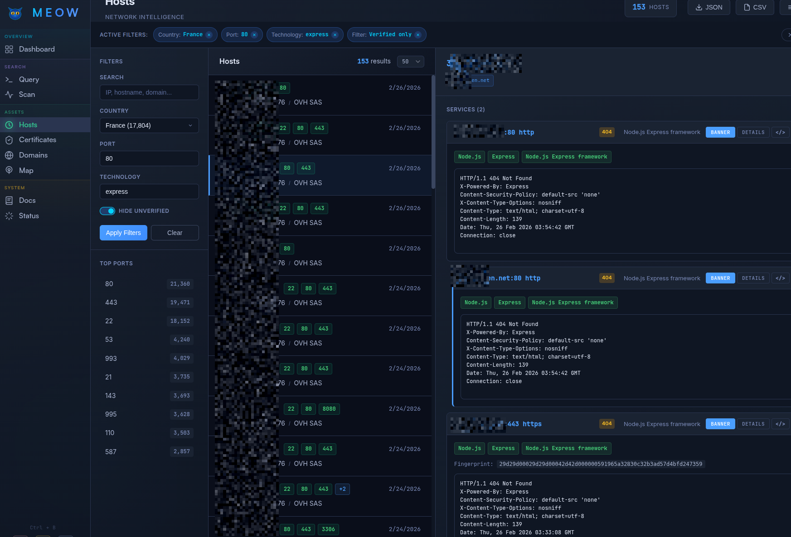
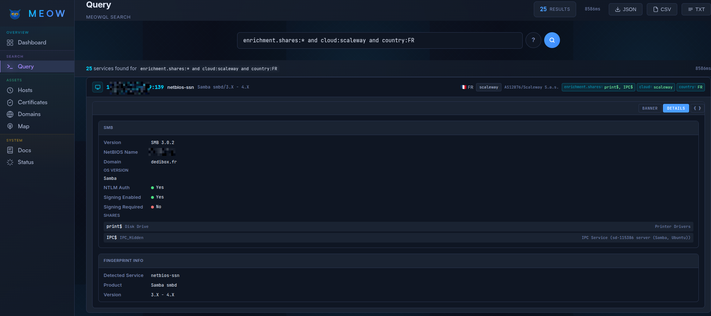
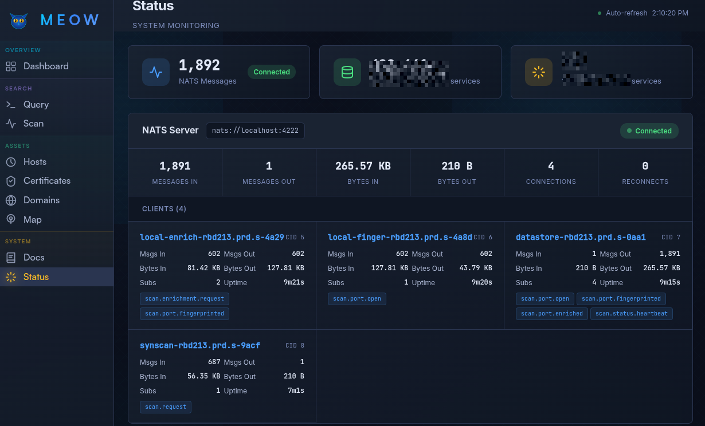
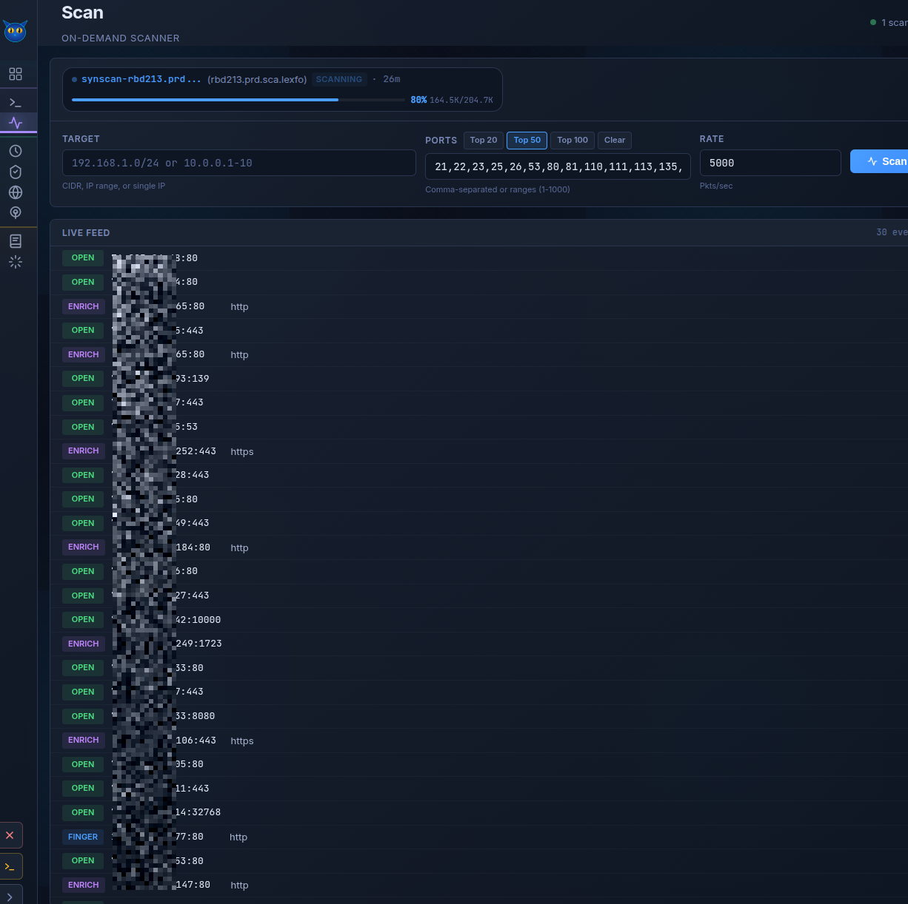
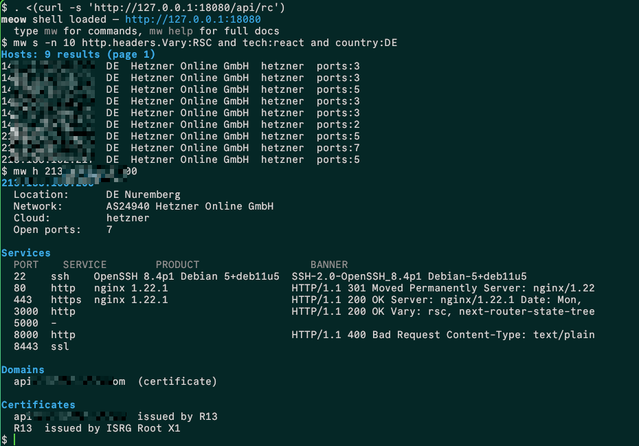
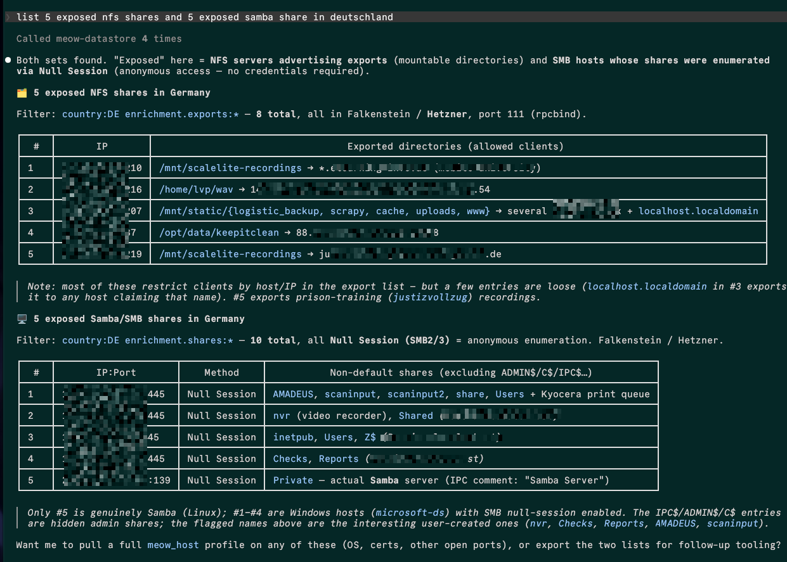
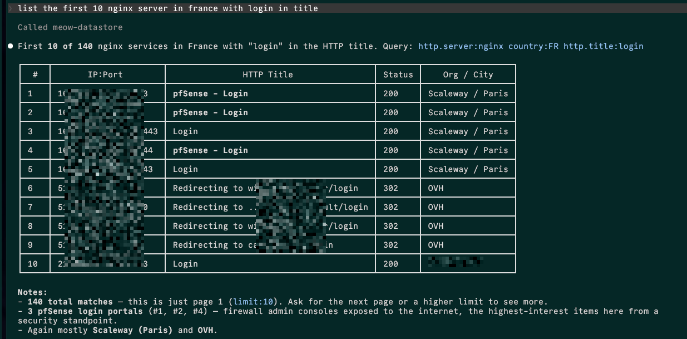

# meow 🐈‍⬛

Modular and distributed network scanning system. Three independent components communicate via **NATS** to scan, identify and enrich network services at scale.

It's an easily deployable shodan/censys/fofa for local network or subsets of internet IP ranges.


```
 ┌─────────────┐       ┌────────────────────────┐       ┌────────────────────┐
 │   SynScan   │──────>│        Grabber         │──────>│     Datastore      │
 │             │       │                        │       │                    │
 │  open/SYN   │       │  Fingerprint           │       │  Frontend          │
 │  scanner    │0..n   │  + Enrichment          │0..n   │  SQL + NATS + API  │
 └─────────────┘       └────────────────────────┘       └────────────────────┘
        │                         │                              │
        └─────────────────────────┴──────────────────────────────┘
                          Bus Pipeline (NATS)
```

---

## Pipeline 🐾🐾🐾

Data flows automatically between modules through three main NATS topics:

```
  SynScan               Grabber                                  Datastore
  ───────               ───────                                  ─────────
 open port ────────> [Fingerprint] ─────> identified service ───> database
scan.port.open        nmap probes         scan.port.fingerprinted    │
                     [Enrichment]  ─────> protocol data ────────> database
                      enrich modules      scan.port.enriched         │
                                                                  SQLite
                                                                 REST/UI WEB
```

---


## Quick Start

### Build

```bash
# Build everything
make

# Or individually
make -C synscan
make -C grabber
make -C datastore

# Docker build for windows/linux/osx binaries
make dist
```

### Local mode (everything on one machine)

```bash
# 1. Datastore starts NATS on nats://127.0.0.1:4222 and REST api on http://localhost:18080
./datastore

# 2. Grabber fingerprint + enrichment
./grab local

# 3. Synscan daemon mode (controllable from the REST api )
sudo ./synscan --daemon
```


### Distributed mode

For large scans, spread components across multiple machines:

```bash
# Machine 1 — Datastore
./datastore --nats-host 0.0.0.0 --nats-token SECRET --api-bind 0.0.0.0 --api-pass APIKEY

# Machine 2 — Grabber (like synscan can be launched multiple times to scale)
./grab finger --nats-url nats://10.0.0.1:4222 --nats-token SECRET
./grab enrich --nats-url nats://10.0.0.1:4222 --nats-token SECRET

# Machine 3 — SynScan
sudo ./synscan -t 10.0.0.0/8 -P 1000 -r 50000 \
    --nats-url nats://10.0.0.1:4222 --nats-token SECRET
```

NATS queue groups allow running multiple instances of each component without duplicate processing.

---

## MCP mode

```json
{
  "mcpServers": {
    "meow-datastore": {
      "type": "http",
      "url": "http://localhost:18080/mcp"
    }
  }
}
```


## Components

### [synscan](synscan/)

TCP port scanner using forged SYN packets. Detects open ports without completing the TCP handshake.

- Auto-detected transport: PACKET_MMAP > Raw Socket > Connect
- Linux support (AF_PACKET, SOCK_RAW) and Windows (Npcap)
- Deterministic scan with resume token to pick up an interrupted scan
- nmap-style targets: CIDR, octet ranges, combinations, or input file
- Daemon mode to receive scan orders via NATS


```bash
sudo ./synscan -t 192.168.1.0/24 -P 100 -r 10000 --nats-token SECRET
```

> Full documentation: **[synscan/README.md](synscan/README.md)**

---

### [grab](grabber/)

Service identification and data extraction from discovered services. Combines two stages into a single binary, `grab`.

- **Fingerprint** : Identifies services using nmap existing probes.

- **Enrichment**  : Extracts protocol-specific data through several modules.

| Category | Modules |
|----------|---------|
| Web | http, ipp, icecast, couchdb, elasticsearch, influxdb |
| Email | smtp, pop3/s, imap/s |
| Databases | mysql, postgres, mongodb, redis, oracle, mssql, cassandra, memcached |
| Directory / DNS | ldap/s, dns, netbios, x11 |
| Remote access | ssh, telnet, vnc, rdp |
| File transfer | ftp, rsync, tftp, nfs, git, afp |
| Messaging | mqtt, amqp, xmpp, irc, mumble, teamspeak, sip |
| Network | smb, snmp, ntp, modbus, coap, openvpn, pptp, upnp |
| Misc | rpc, rtsp, minecraft, ajp13, lpd, mpd, nntp, syslog, banner... |

Still a lot of work to match all the enrichment cases of fingerprinted protocols.


> Full documentation: **[grabber/README.md](grabber/README.md)**

---

### [datastore](datastore/)

Central hub of the system it stores results, exposes a web interface and orchestrate workers.

- Embedded NATS and SQLite instances
- REST API and WebUI to navigate on results with custom query language MeowQL
- MCP Model Context Protocol endpoint for AI integration

> Full documentation: **[datastore/README.md](datastore/README.md)**

---

**Optional**: MaxMind GeoIP databases (`GeoLite2-City.mmdb`, `GeoLite2-ASN.mmdb`) for geographic enrichment.


# Usage

The datastore exposes three interfaces:

- A **REST API** to query the dataset, consumed by both the Web UI and CLI
- An **MCP server** accessible over stdio or streamable HTTP
- The **NATS bus** that workers subscribe to

## The REST API

While the scan and fingerprint pipeline runs, you can query the datastore live via the host, certificate or domain views:



You can also dig into enrichment data values using the MeowQL query language:



During a pipeline run, you can diagnostic every connected node in real time:



When synscan runs in daemon mode, the scan menu pop and its jobs and packet-level progress are visible live:



The same actions are available from your shell (**requires `curl` and `jq`**):




## The MCP Server

As http streamable or stdio connector, see datastore README for information





## The NATS bus

It is possible for a remote tool to benefit from NATS bus to subscribe on events.

This script waits for every enriched ssh service and print details

```python
#!/usr/bin/env python3
import asyncio
import nats
from nats.errors import Error as NATSError
import json
import sys

async def main():
    subject = "scan.port.enriched"
    queue_name = "my_custom_queue" 

    try:
        nc = await nats.connect("nats://localhost:4222", name="python-sub")
        done = asyncio.Future()
        async def message_handler(msg):
            data = msg.data.decode()
            try:
                obj = json.loads(data)
                if obj["service"] == "ssh":
                    if obj["data"] != None:
                        print(f"{json.dumps(obj, indent=2, ensure_ascii=False)}")           
            except json.JSONDecodeError:
                pass  

        await nc.subscribe(
            subject=subject,
            queue=queue_name,
            cb=message_handler
        )

        await done

    except NATSError as e:
        print(f"nats error : {e}", file=sys.stderr)
        sys.exit(1)
    except KeyboardInterrupt:
        print("exiting ...")
    except Exception as e:
        print(f"error : {e}", file=sys.stderr)
        sys.exit(1)
    finally:
        if 'nc' in locals():
            await nc.close()
            
if __name__ == "__main__":
    asyncio.run(main())
```
